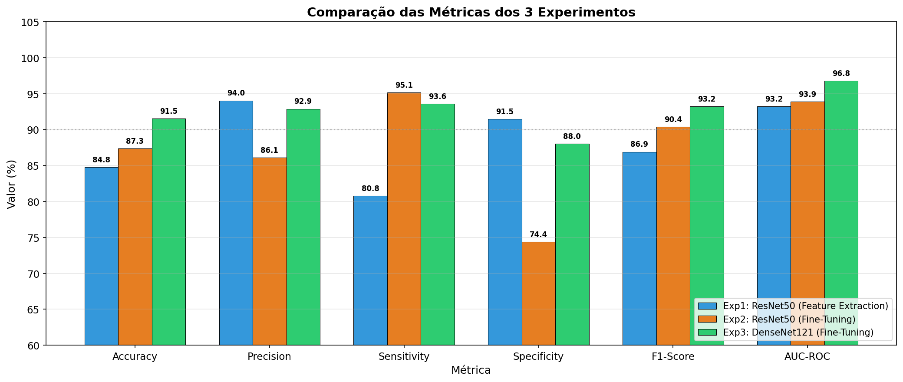
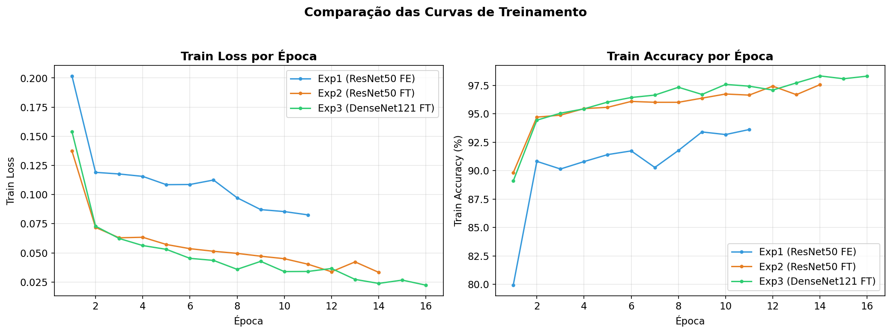
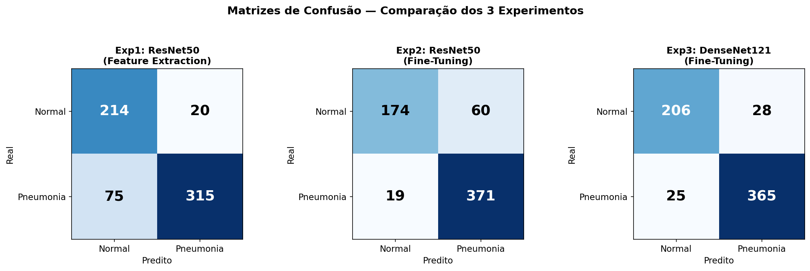
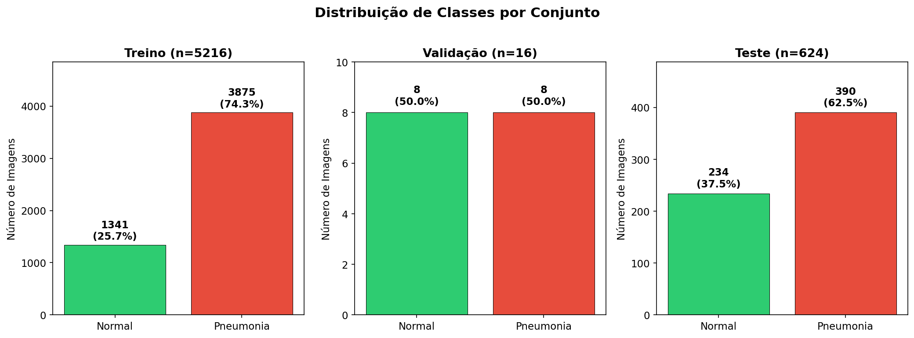

# Classificação de Pneumonia em Raio-X de Tórax com Transfer Learning

Projeto de Deep Learning para detecção automatizada de pneumonia em imagens de raio-X de tórax utilizando **Transfer Learning** com redes neurais convolucionais pré-treinadas no ImageNet.

> **Trabalho Final — Processamento de Imagem e Visão Computacional (PIVC)**

🔗 **[Ver página do projeto online](https://idarlandias.github.io/Trabalho_Final_PIVC/)**

---

## Objetivo

Desenvolver e comparar modelos de classificação binária (**Normal** vs **Pneumonia**) utilizando diferentes estratégias de transfer learning, avaliando o impacto do fine-tuning e da escolha de arquitetura nos resultados.

## Dataset

**Chest X-Ray Images (Pneumonia)** — [Kaggle](https://www.kaggle.com/datasets/paultimothymooney/chest-xray-pneumonia)

| Conjunto | Imagens | Normal | Pneumonia |
|----------|---------|--------|-----------|
| Treino   | 5.216   | 1.341  | 3.875     |
| Validação| 16      | 8      | 8         |
| Teste    | 624     | 234    | 390       |

## Experimentos

Foram realizados **3 experimentos** com diferentes configurações:

| # | Modelo | Estratégia | Camadas Descongeladas | LR | Batch Size |
|---|--------|------------|-----------------------|----|------------|
| 1 | ResNet50 | Feature Extraction | 0 (todas congeladas) | 0.001 | 32 |
| 2 | ResNet50 | Fine-Tuning Parcial | 10 | 0.0001 | 32 |
| 3 | DenseNet121 | Fine-Tuning Parcial | 20 | 0.0001 | 16 |

## Resultados

| Métrica | Exp 1 — ResNet50 (FE) | Exp 2 — ResNet50 (FT) | Exp 3 — DenseNet121 (FT) |
|---------|----------------------|----------------------|--------------------------|
| **Accuracy** | 84,78% | 87,34% | **91,51%** ✅ |
| **Precision** | **94,03%** ✅ | 86,08% | 92,88% |
| **Sensitivity** | 80,77% | **95,13%** ✅ | 93,59% |
| **Specificity** | **91,45%** ✅ | 74,36% | 88,03% |
| **F1-Score** | 86,90% | 90,38% | **93,23%** ✅ |
| **AUC-ROC** | 93,19% | 93,90% | **96,78%** ✅ |

### Melhor modelo: Experimento 3 — DenseNet121

O DenseNet121 com fine-tuning parcial obteve o melhor equilíbrio entre sensibilidade e especificidade, sendo o mais adequado para aplicação clínica.

## Visualizações

<p align="center">
  
  
</p>
<p align="center">
  
  
</p>

## Tecnologias

- **Python** — Linguagem principal
- **PyTorch / torchvision** — Treinamento e modelos pré-treinados
- **scikit-learn** — Métricas de avaliação
- **matplotlib / seaborn** — Visualizações
- **NumPy / Pandas** — Manipulação de dados

## Estrutura do Projeto

```
Trabalho_Final_PIVC/
├── config.py                    # Configurações e hiperparâmetros
├── train.py                     # Script de treinamento
├── evaluate.py                  # Script de avaliação
├── utils.py                     # Funções auxiliares
├── Trabalho_Final_PIVC.ipynb    # Notebook Jupyter
├── index.html                   # Página de apresentação
├── data/chest_xray/             # Dataset (não incluído no repo)
│   ├── train/
│   ├── val/
│   └── test/
└── results/                     # Resultados gerados
    ├── exp1/                    # Experimento 1
    ├── exp2/                    # Experimento 2
    ├── exp3/                    # Experimento 3
    └── comparison.csv           # Tabela comparativa
```

## Como Executar

```bash
# 1. Baixar o dataset do Kaggle e extrair em data/chest_xray/

# 2. Treinar os modelos
python train.py                  # Todos os experimentos
python train.py --exp exp1       # Apenas experimento 1

# 3. Avaliar no conjunto de teste
python evaluate.py               # Todos os experimentos
python evaluate.py --exp exp3    # Apenas experimento 3
```

## Principais Conclusões

- **Fine-tuning supera Feature Extraction** — Descongelar camadas permite adaptação ao domínio médico
- **DenseNet121 supera ResNet50** — Conexões densas capturam melhor os padrões em raio-X
- **Early Stopping eficiente** — Todos os modelos convergiram antes do limite de épocas
- **Class weights essenciais** — O balanceamento corrigiu o viés do dataset desbalanceado
